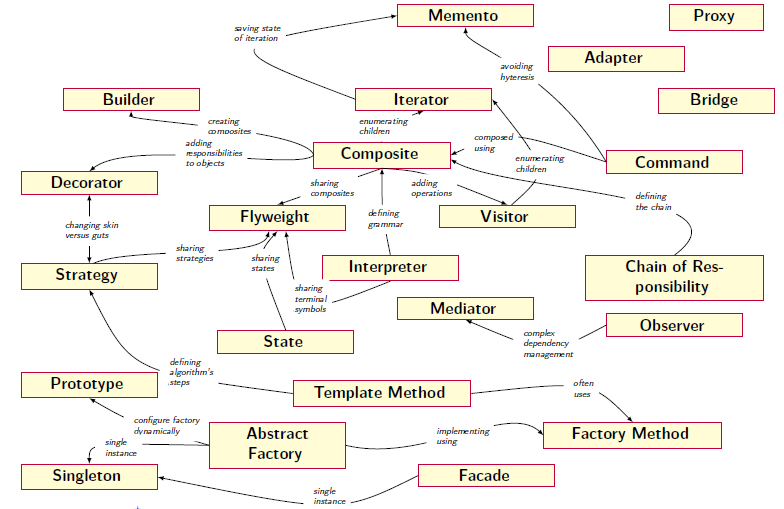

<strong>Név: </strong>Fráter Tamás 
<strong>Neptunkód: </strong>GM8XI9  
<strong>Tantárgy: </strong>Programozási technológiák (BPI1116L)

<h1 style="text-align: center;">Tervezési minták</h1>

#### Mit nevezünk tervezési mintának?

A tervezési minták (design patterns) gyakran felmerülő problémákra adott újrafelhasználható megoldások. Ezek segítik a szoftvertervezést és a fejlesztést is, mivel olyanok mint a tervrajzok, amelyeket testreszabhatunk. Ez nem egy konkrét kódrészlet vagy algoritmus, amelyet bemásolva használhatunk, hanem egy általános koncepció egy adott probléma megoldására.  
A tervezési minta leírása objektum orientált programok esetében mivel a megoldás egy magasabb szintű leírása, így megadja azokat az egymással kommunikáló objektumokat, osztályokat, amelyek együttes viselkedése az adott problémára megoldás lehet.  
A tervezési minták által a rendszer egyszerűbb és karbantarhatóbb, illetve újrafelhasználhatóbb is lesz. Ennek következében ezek ismeretében pedig könnyeb a rendszert megérteni, mivel egy-egy rész megértése a kódban így egyszerűbbé válik.

#### Tervezési minták felépítése
<ul>
<li style="text-align: justify;"><strong>A minta neve: </strong>Fontos a jó elnevezés, mivel a név már maga utalhat arra, hogy milyen problémára is próbál megoldást nyújtani.</li>
<li style="text-align: justify;"><strong>A minta szándéka, motivációja: </strong>Röviden leírja a problémát és elmagyarázza a probléma megoldását is.</li>
<li style="text-align: justify;"><strong>Osztályok felépítése: </strong>Megmutatja a minta részeit, annak összefüggéseit, azaz minta elemeinek absztrakt leírása és az azok között lévő kapcsolatok és feladatok. Ez nem egy implementáció, ezt mindig adaptálni kell az aktuális rendszerhez.</li>
</ul>

#### Tervezési minták kategóriái

A tervezési mintákat legfőbb tulajdonságaik alapján különböző kategóriákba sorolhatóak. Lehet csoportosítani rendeltetésük szerint, vagy hatáskörül szerint is.

Most rendeltetésük szerint fogjuk őket csoportosítani. Ez a csoportosítás a tervezési minták alkalmazási területére és céljára fókuszál.

<ul>
<li style="text-align: justify;"><strong>Létrehozási minták: </strong>Ezek a minták arra összpontosítanak, hogyan lehet létrehozni objektumokat, ezek növelik a meglévő kód rugalmasságát és újrafelhasználsát.
<ul>
<li style="text-align: justify;"><strong>Gyártó művelet (Factory Method): </strong>A Gyártó művelet, más néven Virtual Constructor, egy olyan tervezési minta, amely egy interfészt definiál egy objektum létrehozásához, de azt a létrehozási folyamatot az alosztályokra hagyja. Ez lehetővé teszi az alosztályoknak, hogy a példányosítás részleteit maguk határozzák meg, ezáltal rugalmasságot és kibővíthetőséget biztosítva a kódban. A Factory Method segítségével egy alaposztály definiálhat egy interfészt vagy absztrakt osztályt, amelyet az alosztályok implementálhatnak a saját konkrét objektumaik létrehozásához.</li>
<li style="text-align: justify;"><strong>Absztrakt gyártó (Abstract Factory): </strong>Az Absztrakt gyártó egy olyan tervezési minta, amely egy interfészt biztosít a kapcsolódó vagy egymástól függő objektumok családjának létrehozásához anélkül, hogy a konkrét osztályokat specifikálná. Ezáltal a kliens nem ismeri előre a létrehozott objektumok konkrét típusát, csak az absztrakt interfészt használva. Az Abstract Factory lehetővé teszi a rendszer architektúrájának egyszerű cseréjét, mivel a kliens csak az absztrakt interfészt használja.</li>
<li style="text-align: justify;"><strong>Egyke (Singleton): </strong>A Singleton egy olyan tervezési minta, amely biztosítja, hogy egy osztályból csak egy példány létezhessen, és ehhez globális hozzáférést biztosít. A Singleton megakadályozza az osztály többszöri példányosítását, és egyetlen globális példányt biztosít az alkalmazás számára. Ez különösen hasznos, ha egy osztálynak csak egyetlen példánya lehet jelen a rendszerben, például konfigurációkezelés vagy erőforrás-kezelés céljából.</li>
<li style="text-align: justify;"><strong>Építő (Builder): </strong>Az Építő egy olyan tervezési minta, amely a komplex objektumok létrehozását szolgálja, miközben megengedi azok lépésről lépésre történő konfigurációját. Az Építő minta segít elszigetelni a bonyolult építési folyamatokat, és lehetővé teszi, hogy a kliensek különböző konfigurációkat alkalmazzanak anélkül, hogy ismernék az objektum belső szerkezetét. Ez a minta különösen alkalmazható, amikor egy objektum sokféle változatát kell létrehozni.</li>
<li style="text-align: justify;"><strong>Prototípus (Prototype): </strong>A Prototípus egy olyan tervezési minta, amely a prototípus példány használatával egy alap objektumot definiál, majd az újabb objektumokat ennek a prototípusnak a lemásolásával állítja elő. Ez a minta különösen hatékony, amikor az objektum létrehozása drága vagy összetett folyamat, és azok sokféle variációban fordulhatnak elő. A Prototípus lehetővé teszi az új objektumok gyors és hatékony létrehozását a meglévő példányokból történő másolással.</li>
</ul>
</li>
<li style="text-align: justify;"><strong>Szerkezeti minták: </strong>Ezek a minták az osztályok és objektumok összetételével foglalkoznak. Elmagyarázzák, hogyan lehet az objektumokat és osztályokat nagyobb szerkezetekbe összeállítani, miközben a szerkezeteket rugalmasan és hatékonyan tartják.
<ul>
<li style="text-align: justify;"><strong>Díszítő (Decorator): </strong>A Díszítő egy olyan tervezési minta, amely lehetővé teszi az objektum funkcionalitásának kiterjesztését dinamikusan. Azaz a Díszítő minta lehetővé teszi a kliensek számára, hogy új funkcionalitást adhassanak hozzá egy objektumhoz anélkül, hogy megváltoztatnák annak alapstruktúráját. Minden díszítő osztály azonos interfésszel rendelkezik, így könnyen kombinálhatók, és lehetőséget adnak az objektumok funkcionalitásának egyszerű bővítésére.</li>
<li style="text-align: justify;"><strong>Illesztő (Adapter): </strong>Az Illesztő egy olyan tervezési minta, amely lehetővé teszi egy már meglévő osztály használatát anélkül, hogy annak interfészét megváltoztatnánk. Az Adapter általában egy köztes osztály, amely összeköti a két inkompatibilis interfészt, lehetővé téve a kliens számára, hogy a régi osztályt a megfelelő interfészen keresztül használja</li>
<li style="text-align: justify;"><strong>Híd (Bridge): </strong>A Híd egy olyan tervezési minta, amely szétválasztja az absztrakciót a megvalósítástól, így mindkettőt külön-külön fejleszthetjük. Az absztrakció egy interfészt definiál, míg a megvalósítás egy másik hierarchiát alkot. A Híd lehetővé teszi az absztrakció és a megvalósítás független változtatását, és egymástól függetlenül bővíthetők.</li>
<li style="text-align: justify;"><strong>Összetétel (Composite): </strong>Az Összetétel egy olyan tervezési minta, amely lehetővé teszi az objektumok hierarchikus szerkezetének létrehozását, és azokat egyformán kezeli. Az összetételnek egy közös interfésze van mind a leveleknek, mind a konténereknek, így egyszerűen kezelhetők és cserélhetők. Ez a minta különösen hasznos, amikor szeretnénk egységesen kezelni az egyszerű és összetett objektumokat.</li>
<li style="text-align: justify;"><strong>Homlokzat (Facade): </strong>A Homlokzat egy olyan tervezési minta, amely egy egységes interfészt biztosít egy rendszer számára, és egyszerűsíti a rendszer többi részéhez való hozzáférést. A Homlokzat mögött rejlő komplexitást elrejti egy egységes interfész mögött, így a kliensek könnyedén használhatják a rendszer egy részét anélkül, hogy ismernék a belső működését.</li>
<li style="text-align: justify;"><strong>Pehelysúlyú (Flyweight): </strong>A Pehelysúlyú egy olyan tervezési minta, amely lehetővé teszi a nagy számú kis súlyú objektum hatékony kezelését. Ehhez a minta a közös adatokat kiszervezi, és azokat megosztja az objektumok között. Így a rendszer kevesebb memóriát használ fel, és hatékonyan kezeli a nagy számú objektumot.</li>
<li style="text-align: justify;"><strong>Helyettes (Proxy): </strong>A Helyettes egy olyan tervezési minta, amely egy másik objektum helyettesítését biztosítja. A Helyettes lehetőséget ad egy köztes objektumnak, hogy kontrollálja vagy kiegészítse egy másik objektum hozzáférését. Ez a minta például akkor hasznos, ha az eredeti objektum hozzáférését vezérelni vagy logolni szeretnénk anélkül, hogy megváltoztatnánk az eredeti objektumot.</li>
</ul>
</li>
<li style="text-align: justify;"><strong>Szerkezeti minták: </strong>Ezek a minták az osztályok és objektumok összetételével foglalkoznak. Elmagyarázzák, hogyan lehet az objektumokat és osztályokat nagyobb szerkezetekbe összeállítani, miközben a szerkezeteket rugalmasan és hatékonyan tartják.
<ul>
<li style="text-align: justify;"><strong>Parancs (Command): </strong>A Parancs egy olyan tervezési minta, amely egy parancsot reprezentál egy objektumban, lehetővé téve ezzel a kérések paraméterezhetővé és eltolhatóvá tételét, kérések rögzítését és visszavonását, valamint különböző kéréseket tároló objektumok kezelését.</li>
<li style="text-align: justify;"><strong>Megfigyelő (Observer): </strong>A Megfigyelő egy olyan tervezési minta, amely az objektumok közötti egyes események követését és azokra reagálást teszi lehetővé. Az egyik objektum változása esetén a Megfigyelők (megfigyelő objektumok) értesítést kapnak és reagálhatnak az eseményre.</li>
<li style="text-align: justify;"><strong>Látogató (Visitor): </strong>A Látogató egy olyan tervezési minta, amely lehetővé teszi egy objektum struktúrájának módosítását anélkül, hogy megváltoztatnánk azok osztályait. A Látogató segítségével új műveletek adhatók hozzá egy objektumcsoporton belül, és a látogatott objektumok egységes interfészen keresztül válnak hozzáférhetővé.</li>
<li style="text-align: justify;"><strong>Felelősséglánc (Chain of Responsibility): </strong>A Felelősséglánc egy olyan tervezési minta, amely egy sor objektumban szétválasztja egy kérés feldolgozását. Az objektumok sorban végigpróbálják a kérést, és az az objektum kezeli el, amelynek felelősségi terjedelme tartalmazza a kérést.</li>
<li style="text-align: justify;"><strong>Bejáró (Iterator): </strong>A Bejáró egy olyan tervezési minta, amely segít egy objektum elemein végigiterálni anélkül, hogy feltárnánk az objektum belső szerkezetét. A Bejáró általában egy interfészt biztosít, amely definiálja az iteráció műveleteit, és különböző objektumok implementálhatják ezt az interfészt.</li>
<li style="text-align: justify;"><strong>Közvetítő (Mediator): </strong>A Közvetítő egy olyan tervezési minta, amely egy közvetítő objektumot használ a rendszer komponensei közötti kommunikáció irányítására. Ez segít elkerülni a komponensek közvetlen kölcsönhatását, és laza kapcsolatot biztosítani közöttük.</li>
<li style="text-align: justify;"><strong>Emlékeztető (Memento): </strong>Az Emlékeztető egy olyan tervezési minta, amely egy objektum állapotának elmentését és visszaállítását biztosítja anélkül, hogy feltárnánk vagy befolyásolnánk az objektum belső reprezentációját. Az Emlékeztető hasznos lehet például visszavonási mechanizmusokban.</li>
<li style="text-align: justify;"><strong>Állapot (State): </strong>Az Állapot egy olyan tervezési minta, amely lehetővé teszi egy objektum állapotának dinamikus változását, és az objektum viselkedését attól függően módosítja, hogy milyen állapotban van.</li>
<li style="text-align: justify;"><strong>Stratégia (Strategy): </strong>A Stratégia egy olyan tervezési minta, amely lehetővé teszi egy algoritmus cseréjét az anélkül, hogy befolyásolná az objektum, amely használja azt. A stratégia egy családja cserélhető algoritmusokat kínál egy közös interfészen keresztül.</li>
<li style="text-align: justify;"><strong>Sablonfüggvény (Template Method): </strong>A Sablonfüggvény egy olyan tervezési minta, amely definiál egy algoritmust, de néhány lépést a leszármazott osztályokra hagy. A sablonfüggvény segítségével az algoritmus keretét meghatározhatjuk, és a konkrét lépéseket az alosztályok implementálhatják. Ez lehetővé teszi a kód újrafelhasználását és a változó részletek rugalmas kezelését.</li>
</ul>
</li>
</ul>

#### Tervezési minták közötti kapcsolatok

A valós alkalmazási környezettől függően egy minta egyéb minták használatát is igényelheti, így ezek kombinálhatóak. A tervezési minták általában jól illeszkednek egymáshoz, és az együttes alkalmazásuk segíthet a rugalmas és karbantartható kód kialakításában.

